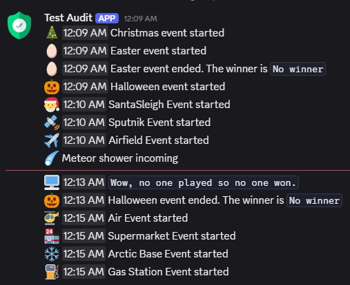

# rServerMessages


 
🚀 **The ultimate Discord integration for Rust servers** - Advanced PvP combat analysis with headshot detection, granular death filtering, RCON security whitelist, comprehensive event tracking with rich embeds, bed/bag/towel rename monitoring with blacklist protection, C4 and rocket logging, F7 report tracking, player tracker with IP history, playtime tracking, connection analytics, Deep Sea event alerts with in-game notifications, and smart queue management.

<div align="center">
  
  <p><em>Rich Discord embeds showing premium server events with detailed information and visual styling</em></p>
</div>

<div align="center">
  
  <p><em>Rich Discord embeds showing other server events with detailed information and visual styling</em></p>
</div>

## 🚀 Features

### 📊 Comprehensive Event Tracking
- **Player Events** - Connections, disconnections, deaths with detailed analytics
- **Chat Monitoring** - Global and team chat with enhanced formatting
- **Admin Actions** - RCON commands, bans, kicks, mutes with security tracking
- **Server Events** - Startup, shutdown, and performance monitoring
- **Premium Plugin Events** - Support for 15+ popular Rust plugins
- **Bed/Bag/Towel Rename Logging** - Monitor sleeping bag, bed, and beach towel renames with blacklist protection *(NEW v1.0.5)*
- **C4 & Rocket Logging** - Track explosive usage with NPC filtering *(NEW v1.0.7)*
- **F7 Report Logging** - Log player reports with color-coded Discord embeds *(NEW v1.0.8)*
- **Player Tracker** - Cumulative player database with IP history, geolocation, name tracking, playtime tracking, and connection analytics *(NEW v1.0.9-1.0.11)*
- **Deep Sea Alerts** - Open/close alerts with 30 & 15 minute warnings, rich Discord embeds, and in-game chat notifications *(NEW v1.0.15)*

### 💀 Elite Combat Analysis System *(NEW v0.0.270)*
- **🎯💀 Headshot Detection** - Special icons, titles, and priority alerts for headshots
- **🩸 Body Part Tracking** - Precise hit location (Head, Chest, Stomach, Arm, Leg)
- **⚡ Smart Kill Classification** - Headshots prioritized over high damage
- **🎛️ Granular Death Filtering** - Individual toggles for PvP, PvE, suicide, drowning
- **📊 Enhanced Combat Stats** - Weapon, damage with body part, distance analysis
- **🎯 Kill Type Indicators** - Devastating Headshot, Devastating Kill, Player Eliminated
- **📍 Tactical Coordinates** - Grid positions with instant teleport commands
- **🏹 Distance Mastery** - Point blank to extreme range categorization

### 🔐 Advanced Security & Administration *(Enhanced v0.0.270)*
- **🚨 RCON Trusted IP Whitelist** - Eliminate spam from known admin tools
- **⚠️ Enhanced Security Alerts** - Unknown IPs get prominent orange-red warnings
- **🌍 RCON Command Monitoring** - IP tracking with geolocation and country detection
- **👥 User Management** - Comprehensive ban, kick, unban logging with reasons
- **🔑 Permission Tracking** - Real-time group and permission change monitoring
- **📊 Steam Profile Integration** - Account age, profile status, activity tracking
- **🗺️ Geographic Intelligence** - Country detection with flag emojis
- **👤 Admin Privacy Controls** - Configurable admin activity filtering

### 💬 Advanced Chat Features
- **Team Chat Enhancement** - Team member status, locations, and structure
- **Chat Filtering** - Integration with AntiSpam, UFilter, and BetterChatMute
- **Rich Embeds** - Enhanced team chat with player details and teleport commands
- **Profanity Filtering** - Automatic content moderation support

### 🎮 Premium Plugin Integration
- **Air Events** - Helicopter and air drop monitoring
- **Airfield Events** - Military base activities
- **Arctic Base Events** - Cold environment challenges
- **Armored Train Events** - Train heist tracking
- **Gas Station Events** - Fuel station activities
- **Supermarket Events** - Shopping center events
- **Sputnik Events** - Satellite activities
- **Raidable Bases** - Base raids with difficulty tracking and completion status
- **Holiday Events** - Christmas, Easter, Halloween with winner tracking

### 🚀 Smart Queue Management
- **Rate Limiting Protection** - Prevents Discord API abuse
- **Message Batching** - Combines multiple messages for efficiency
- **Retry System** - Automatic retry with exponential backoff
- **Error Recovery** - Graceful handling of network issues
- **Queue Cooldown** - Intelligent delay system for connection problems

### 🎨 Rich Discord Integration
- **Advanced Embeds** - Color-coded, structured messages with timestamps
- **Webhook Management** - Multiple webhook support for different channels
- **Message Editing** - Single updating messages to prevent spam
- **Custom Avatars** - Bot customization with server branding
- **Field Organization** - Structured information display
- **Thumbnail Support** - Visual enhancement for better readability

## 📋 Requirements

- **Rust Dedicated Server**
- **Umod (Oxide)** framework
- **Discord webhook(s)** for message delivery
- **Optional:** Steam Web API key for enhanced player data
- **Optional:** Supported premium plugins for event integration

## 🔧 Installation

1. Download the [latest release](https://github.com/FtuoilXelrash/rServerMessages/releases)
2. Copy `rServerMessages.cs` to your server's `oxide/plugins/` directory
3. The plugin will auto-generate its configuration file on first load
4. Configure your Discord webhooks in `oxide/config/rServerMessages.json`
5. Reload the plugin or restart your server

## ⚙️ Complete Configuration Reference

The plugin creates a comprehensive configuration file at `oxide/config/rServerMessages.json`:

### Global Settings
```json
{
  "Global settings": {
    "Log to console?": false,
    "Use AntiSpam plugin on chat messages": false,
    "Use UFilter plugin on chat messages": false,
    "Hide admin connect/disconnect messages": false,
    "Hide NPC death messages": false,
    "Include death coordinates in death messages": true,
    "Use Discord Embeds for death messages": true,
    "Use enhanced embeds for connections": true,
    "Show country information (requires internet)": true,
    "Show server population in connection messages": true,
    "Show combat details in death messages": true,
    "Use enhanced embeds for server messages": true,
    "Show kill distance in PvP deaths": true,
    "High damage threshold for special kills": 75.0,
    "Use enhanced embeds for RCON messages": true,
    "Replacement string for tags": "`",
    "Queue interval (1 message per ? seconds)": 1.0,
    "Queue cooldown if connection error (seconds)": 60.0,
    "Public Chat Webhook URL": "",
    "Private Admin Webhook URL": "",
    "Server Messages Webhook URL": "",
    "RCON command blacklist": [
      "serverinfo",
      "server.hostname",
      "server.headerimage",
      "server.description",
      "server.url",
      "playerlist",
      "status"
    ],
    "RCON trusted IPs (hide connections from these)": [
      "127.0.0.1",
      "::1"
    ],
    "Steam Web API Key (for profile data)": ""
  }
}
```

### Discord Webhook Configuration
| Setting | Description | Recommended Use |
|---------|-------------|-----------------|
| `Public Chat Webhook URL` | Webhook for general chat messages | Public channel for community chat |
| `Private Admin Webhook URL` | Webhook for administrative events | Private admin channel for security events |
| `Server Messages Webhook URL` | Webhook for server events and plugins | Public or private channel for server updates |

### Event Categories
All event categories can be individually enabled/disabled:

#### Player Events
- **Player death settings** - Combat and death tracking
- **Player connect advanced info settings** - Enhanced connection details
- **Player disconnect settings** - Disconnection monitoring

#### Chat & Communication
- **Chat settings** - Global and local chat monitoring
- **Chat (Team) settings** - Team communication tracking

#### Administrative Events
- **User Banned settings** - Ban/unban notifications
- **User Kicked settings** - Kick notifications
- **User Muted settings** - Mute/unmute tracking
- **User Name Updated settings** - Name change monitoring with monthly log files
- **Permissions settings** - Permission and group changes

#### Monitoring & Logging Events *(NEW v1.0.5-1.0.8)*
- **Bed Rename settings** - Sleeping bag, bed, and beach towel rename tracking with optional blacklist
- **C4 Log settings** - C4 explosive usage tracking with NPC filtering
- **Rocket Log settings** - Rocket usage tracking (Regular, HV, Incendiary, MLRS) with NPC filtering
- **F7 Report Log settings** - Player F7 report logging with color-coded report types
- **Player Tracker settings** - Cumulative player database with IP history, geolocation, playtime tracking, and connection embed enhancement
- **Deep Sea settings** - Deep Sea event open/close/warning alerts with Discord embeds and in-game chat

#### Server Management
- **Server state settings** - Startup/shutdown notifications
- **Server messages settings** - General server announcements
- **Rcon command settings** - RCON command logging
- **Rcon connection settings** - RCON access monitoring

#### Premium Plugin Events
- **Air Event settings** - Helicopter events
- **Airfield Event settings** - Military base activities
- **Arctic Base Event settings** - Cold environment events
- **Armored Train Event settings** - Train heist tracking
- **Gas Station Event settings** - Fuel station activities
- **Supermarket Event settings** - Shopping events
- **Sputnik Event settings** - Satellite activities
- **Raidable Bases settings** - Base raid tracking

#### Holiday Events
- **Christmas settings** - Christmas event tracking
- **Easter settings** - Easter hunt monitoring
- **Halloween settings** - Halloween event tracking
- **SantaSleigh settings** - Santa sleigh events


## 🎯 Elite PvP Combat Intelligence

<div align="center">
  🎯💀 <strong>HEADSHOT DETECTION</strong> 🎯💀<br>
  <em>Advanced headshot recognition with body part analysis</em>
</div>

#### 💀 Headshot Detection System
The plugin features **advanced headshot detection** for Rust servers:

```
🎯💀 Devastating Headshot!
**PlayerVictim** was eliminated by **SniperKing**

💀 Elimination
Killer: SniperKing
Victim: PlayerVictim

🔫 Combat Stats
Weapon: L96 Rifle
Damage: 95.4 💀 (Head shot)
Range: 187.2m (Sniper Range)
💀 HEADSHOT ELIMINATION!
🏹 Long Range Snipe!
```

#### 🩸 Precision Body Part Analysis
**Advanced hit location tracking:**
- 🧠 **Head** - Instant kill recognition with skull icons
- 🫀 **Chest** - Torso hit detection
- 🫤 **Stomach** - Mid-body impact zones
- 🦵 **Arm** - Limb damage tracking
- 🦼 **Leg** - Lower body hit analysis

**Smart Priority System:**
1. 🎯💀 **Headshots** - Always prioritized regardless of damage
2. 🎯 **High Damage** - Configurable threshold hits
3. ⚔️ **Standard Kills** - Regular eliminations

### 🎛️ Granular Death Filtering *(NEW!)*

**Perfect for specialized servers!** Configure exactly which death types to broadcast:

```json
"Player death settings": {
  "Enabled?": true,
  "Enable PvP deaths": true,     // ⚔️ Player vs Player
  "Enable PvE deaths": false,    // 🐻 Animals & NPCs  
  "Enable suicide deaths": false, // 🔫 Self-elimination
  "Enable drowning deaths": true  // 🌊 Water deaths
}
```

**Use Cases:**
- **PvP-Only Servers:** Disable PvE/suicide spam
- **Hardcore Servers:** Show only combat deaths
- **RP Servers:** Filter out accidental deaths
- **Competitive:** Focus on player skill showcases

### 🚨 RCON Security Revolution *(NEW!)*

**End RCON notification spam forever!**

```json
"RCON trusted IPs (hide connections from these)": [
  "127.0.0.1",      // 🏠 localhost IPv4
  "::1",            // 🏠 localhost IPv6  
  "192.168.1.100",  // 🗺️ Your admin panel
  "10.0.0.50"        // 🔧 Management tools
]
```

**Smart Behavior:**
- **✅ Trusted IPs:** Silent console logging, no Discord spam
- **🚨 Unknown IPs:** Prominent security alerts with geolocation
- **🌍 Enhanced Warnings:** Orange-red embeds for suspicious access

**Example Security Alert:**
```
🚨 RCON Connection from Unknown IP
⚠️ Remote administration connection from untrusted IP address

🌐 Connection Details
IP Address: `203.45.67.89`
📍 Location: 🇷🇺 Russia

🔒 Security Notice
⚠️ This IP is not in your trusted whitelist
🛡️ Verify this connection is authorized
```

## 🛏️ Bed/Bag/Towel Rename Monitoring *(NEW v1.0.5)*

### Configuration
```json
"Bed Rename settings": {
  "Enabled?": true,
  "Log to file?": true,
  "Send Discord embed?": true,
  "Blacklist": {
    "Enabled?": true,
    "Block rename on blacklist match?": true,
    "Blacklisted Terms": ["term1", "term2", "term3"],
    "Blacklisted REGEXs": ["REGEX1", "REGEX2", "REGEX3"],
    "Leet Conversion Enabled?": true,
    "Leet Table": { "4": "a", "@": "a", "3": "e", "$": "s", "0": "o", ... }
  }
}
```

### Features
- Detects sleeping bag, bed, and beach towel renames via `CanRenameBed` hook
- **Blacklist system** with simple term matching, regex patterns, and leet speak conversion
- Blacklist matches send **red alert embeds** to Private Admin Webhook
- Normal renames send **orange info embeds** to Private Admin Webhook
- File logging uses monthly rollover: `rServerMessages/BedRenameLog/BedRenameLog_2026-02.json`
- Logs include player, owner, deployer, item type, old name, new name, position, and timestamps

### Discord Embed Example (Blacklist Alert)
```
🚨 Bed Rename Blacklist Alert!
A blacklisted term was detected in a bed rename attempt

🛏️ Rename Details
Item Type: Sleeping Bag
New Name: badword123
Blacklist Terms Detected: badword

👤 Player Info
Player: SomePlayer (76561198000000000)
Owner: OwnerPlayer (76561198000000001)
Deployer: DeployerPlayer (76561198000000002)

📍 Location
Position: 123.4, 56.7, -890.1
```

## 💣 C4 & Rocket Logging *(NEW v1.0.7)*

### Configuration
```json
"C4 Log settings": {
  "Enabled?": true,
  "Log to file?": true,
  "Send Discord embed?": true,
  "Hide NPC events?": true
},
"Rocket Log settings": {
  "Enabled?": true,
  "Log to file?": true,
  "Send Discord embed?": true,
  "Hide NPC events?": true
}
```

### Features
- **C4 Logging** - Tracks C4 explosive usage via `OnExplosiveThrown` hook
- **Rocket Logging** - Tracks rocket launches via `OnRocketLaunched` hook
- Detects rocket types: Regular, HV, Incendiary, MLRS
- **NPC filtering** - Optional hide NPC/scientist explosive usage
- File logging uses monthly rollover: `rServerMessages/C4Log/C4Log_2026-02.json` and `rServerMessages/RocketLog/RocketLog_2026-02.json`
- Discord embeds sent to Private Admin Webhook

### Discord Embed Example (C4)
```
💣 C4 Deployed
A player has deployed C4 explosive

👤 Player Info
Player: RaiderGuy (76561198000000000)

📍 Location
Position: 456.7, 12.3, -234.5

⏰ Time
2026-02-15 14:30:45 UTC
```

## 📋 F7 Report Logging *(NEW v1.0.8)*

### Configuration
```json
"F7 Report Log settings": {
  "Enabled?": true,
  "Log to file?": true,
  "Send Discord embed?": true
}
```

### Features
- Captures all F7 player reports via `OnPlayerReported` hook
- **Color-coded Discord embeds** by report type:
  - 🔴 **Cheat reports** - Red embed
  - 🟠 **Abusive reports** - Orange embed
  - 🟡 **Name reports** - Yellow embed
  - ⚪ **Spam reports** - Grey embed
- **Individual file per report** (not monthly accumulation since reports are rare)
- File naming: `rServerMessages/F7ReportLog/F7Report_2026-02-15_14-30-45.json`
- Logs include reporter info, target info, report type, subject, message, position, and timestamps

### Discord Embed Example (Cheat Report)
```
🚨 F7 Report: cheat
A player has submitted an F7 report

👤 Reporter Info
Reporter: HonestPlayer (76561198000000000)
Position: 123.4, 56.7, -890.1

🎯 Target Info
Target: SuspiciousPlayer (76561198000000001)

📝 Report Details
Type: cheat
Subject: Aimbot suspected
Message: This player hits impossible shots consistently

⏰ Time
2026-02-15 14:30:45 UTC
```

## 👤 Player Tracker *(NEW v1.0.9-1.0.11)*

### Configuration
```json
"Player Tracker settings": {
  "Enabled?": true,
  "Track IP history?": true,
  "Include geolocation with IPs?": true,
  "Show player history in connection embeds?": true,
  "Track playtime?": true,
  "Show server time in connection embeds?": true,
  "Show wipe time in connection embeds?": true
}
```

### Features
- **Cumulative player database** - Persistent data file that grows over time, never resets
- **Connection tracking** - First seen, last seen, total connection count per player
- **IP history** - Every unique IP a player has used, with first/last used timestamps
- **Geolocation** - Country detection for each IP address (uses existing geo lookup)
- **Name tracking** - Current name and all previous names automatically tracked
- **NPC filtering** - Only tracks real Steam players, ignores NPCs
- **Playtime tracking** *(v1.0.10)* - Lightweight, no timers:
  - **Server Time** - All-time cumulative playtime, never resets
  - **Wipe Time** - Playtime since last wipe, auto-resets on `OnNewSave`
  - Session time calculated on connect/disconnect (no 30s tick timers)
  - Periodic flush on `OnServerSave` to protect against crashes
  - Catches up players already connected on plugin reload
  - Smart formatting: `12h 45m` under 24h, `6d 12h 45m` over 24h
- **Local timezone display** *(v1.0.11)* - First Seen timestamp automatically converted from UTC to server local time with timezone abbreviation (e.g. CST, CDT, EST). Automatically handles DST.
- **Enhanced connection embeds** - Injects player history into the admin Discord connection message:
  - New players get a `⚠️ NEW PLAYER - First connection to this server!` alert
  - Returning players show First Seen (local time), Connections, Known IPs, Previous Names, Server Time, Wipe Time

### Storage
- Persistent file: `data/rServerMessages/PlayerTracker/PlayerTracker.json`
- Not monthly rollover - cumulative data kept forever

### Discord Embed Example (Returning Player)
```
🔗 Player Connected

👤 Player Details
Name: SomeGuy
Steam ID: 76561198000000000
IP Address: 1.2.3.4
Account Age: 2 years 3 months
Profile: Public
Location: 🇺🇸 United States

📊 Player History
First Seen: 06-15-2025 9:30 AM CST
Connections: 47
Known IPs: 3
Previous Names: OldName123, AnotherName
Server Time: 6d 12h 23m
Wipe Time: 1d 2h 45m
```

### Discord Embed Example (New Player)
```
🔗 Player Connected

👤 Player Details
Name: FreshSpawn
Steam ID: 76561198000000000
IP Address: 5.6.7.8
Location: 🇬🇧 United Kingdom

⚠️ NEW PLAYER
First connection to this server!
```

## 🌊 Deep Sea Alerts *(NEW v1.0.15)*

### Configuration
```json
"Deep Sea settings": {
  "Enabled?": true,
  "Send Discord embed?": true,
  "Send in-game chat alerts?": true,
  "Alert 30 minutes before close?": true,
  "Alert 15 minutes before close?": true,
  "Alert on close?": true,
  "Wipe duration in seconds (default 10800 = 3 hours)": 10800.0
}
```

### Features
- Monitors the Deep Sea event via `OnDeepSeaOpened` and `OnDeepSeaClosed` hooks
- **Open alert** - Notifies when the Deep Sea zone opens (dark turquoise embed)
- **30 minute warning** - Alert when ~30 minutes remain (yellow embed)
- **15 minute warning** - Alert when ~15 minutes remain (orange embed)
- **Close alert** - Notifies when the Deep Sea zone closes (dark red embed)
- **Plugin reload support** - On reload, detects if Deep Sea is already open and attempts to schedule warnings using reflection. Logs a warning to console if remaining time cannot be determined for that cycle.
- **In-game chat alerts** - Deep blue colored messages broadcast to all players alongside Discord embeds
- **Configurable duration** - Set `Wipe duration in seconds` to match your `deepsea.wipeduration` convar if changed from the default 3 hours
- Discord embeds sent to **Server Messages Webhook**

### Discord Embed Examples
```
🌊 Deep Sea Open                          (dark turquoise)
The Deep Sea is now open!
Head to the deep sea zone for loot and adventure.

🌊 Deep Sea Closing Soon                  (yellow)
The Deep Sea closes in approximately 30 minutes.
Finish up and head back before the zone closes!

🌊 Deep Sea Closing Soon                  (orange)
The Deep Sea closes in approximately 15 minutes.
Time to head back — the zone is closing soon!

🌊 Deep Sea Closed                        (dark red)
The Deep Sea has closed.
```

### In-Game Chat Alert Example
```
The Deep Sea is now open!               (deep blue text, no icon)
The Deep Sea closes in ~30 minutes!     (deep blue text, no icon)
The Deep Sea closes in ~15 minutes!     (deep blue text, no icon)
The Deep Sea has closed.                (deep blue text, no icon)
```

## 📁 Log File Organization *(NEW v1.0.6)*

All log files are organized in subfolders under `oxide/data/rServerMessages/`:

```
rServerMessages/
├── PlayerNameChangeLog/
│   └── PlayerNameChangeLog_2026-02.json     (monthly rollover)
├── BedRenameLog/
│   └── BedRenameLog_2026-02.json            (monthly rollover)
├── C4Log/
│   └── C4Log_2026-02.json                   (monthly rollover)
├── RocketLog/
│   └── RocketLog_2026-02.json               (monthly rollover)
├── F7ReportLog/
│   └── F7Report_2026-02-15_14-30-45.json    (individual per report)
└── PlayerTracker/
    └── PlayerTracker.json                    (cumulative, persistent)
```

## 🎮 Advanced Features

### Enhanced Death System

#### Combat Analytics
The plugin provides detailed combat information including:

**Distance Categories:**
- Point Blank (< 3m) 💥
- Close Quarters (3-15m)
- Medium Range (15-50m)
- Long Range (50-100m)
- Sniper Range (100-200m) 🏹
- Extreme Range (200m+)

**Special Kill Indicators:**
- High Damage Hits (configurable threshold) 🎯
- Long Range Snipes 🏹
- Point Blank Eliminations 💥

**Death Types:**
- PvP (Player vs Player) ⚔️
- PvE (Player vs Environment) 🐻
- Suicide 🔫
- Drowning 🌊
- Environmental 💀

#### Entity Recognition
The plugin recognizes 50+ entity types including:

**NPCs & Animals:**
- Scientists, Heavy Scientists, Murderers
- Bears, Wolves, Boars, Sharks
- Tunnel Dwellers, Underwater Dwellers
- Zombies, Gingerbread NPCs

**Military & Vehicles:**
- Patrol Helicopters, Bradley APC
- Attack Helicopters, Minicopters
- Scrap Transport Helicopters

**Defensive Structures:**
- Auto Turrets, Shotgun Traps
- Flame Turrets, SAM Sites
- Tesla Coils, Bear Traps, Landmines

### Steam Profile Integration

When a Steam Web API key is configured, the plugin provides:

**Account Information:**
- Account age with new account warnings ⚠️
- Profile visibility status (Public/Private)
- Profile configuration status
- Last activity tracking

**Security Features:**
- New account detection (< 30 days)
- Profile status validation
- Recent activity monitoring

### Geographic Information

**IP Geolocation:**
- Country detection with flag emojis 🌍
- Automatic timezone consideration
- Privacy-focused implementation

### Team Chat Enhancement

**Team Information Display:**
- Team member count and status
- Online/Sleeping/Offline indicators 🟢💤🔴
- Member locations with grid coordinates
- Teleport commands for admin convenience

**Status Indicators:**
- 🟢 Online - Active players
- 💤 Sleeping - Sleeping players
- 🔴 Offline - Disconnected players

### RCON Security Monitoring

**Command Categorization:**
- 🔧 Server Configuration
- ⚠️ Admin Actions (Critical)
- 📊 Information Queries
- 🎮 Game Control Commands
- ⚡ Other Commands

**Security Features:**
- IP address tracking with geolocation
- Critical action highlighting
- Command blacklist support
- Access pattern monitoring

## 📱 Discord Setup Guide

### Step 1: Create Discord Webhooks

**For Public Chat:**
1. Go to your public Discord channel
2. Right-click → "Edit Channel"
3. Navigate to "Integrations" → "Webhooks"
4. Click "New Webhook"
5. Name: "Rust Server Chat"
6. Copy webhook URL

**For Admin Events:**
1. Go to your private admin Discord channel
2. Follow same steps as above
3. Name: "Rust Server Admin"
4. Copy webhook URL

**For Server Events:**
1. Go to your server updates Discord channel
2. Follow same steps as above
3. Name: "Rust Server Events"
4. Copy webhook URL

### Step 2: Configure Plugin
```json
{
  "Global settings": {
    "Public Chat Webhook URL": "https://discord.com/api/webhooks/YOUR_PUBLIC_WEBHOOK_ID/YOUR_PUBLIC_TOKEN",
    "Private Admin Webhook URL": "https://discord.com/api/webhooks/YOUR_ADMIN_WEBHOOK_ID/YOUR_ADMIN_TOKEN",
    "Server Messages Webhook URL": "https://discord.com/api/webhooks/YOUR_SERVER_WEBHOOK_ID/YOUR_SERVER_TOKEN",
    "Steam Web API Key (for profile data)": "YOUR_STEAM_API_KEY_HERE"
  }
}
```

### Step 3: Enable Events
Enable the events you want to monitor:
```json
{
  "Player death settings": {
    "Enabled?": true,
    "Enable PvP deaths": true,
    "Enable PvE deaths": false,
    "Enable suicide deaths": false,
    "Enable drowning deaths": true
  },
  "Chat settings": {
    "Enabled?": true
  },
  "User Banned settings": {
    "Enabled?": true
  }
}
```

## 🔑 Steam Web API Key Setup

### Obtaining Your API Key
1. Visit [Steam Web API Key Registration](https://steamcommunity.com/dev/apikey)
2. Log in with your Steam account
3. Enter your domain name (can be localhost for development)
4. Copy the generated 32-character API key
5. Add it to your configuration

### Benefits of API Key
- **Account Age Detection** - Identify new/suspicious accounts
- **Profile Status** - Public vs private profiles
- **Activity Tracking** - Recent login information
- **Enhanced Security** - Better player vetting

## 🎨 Discord Message Examples

### 🎯💀 Headshot Elimination Example *(NEW!)*
```
🎯💀 Devastating Headshot!
**TargetPlayer** was eliminated by **SniperElite**

💀 Elimination
Killer: SniperElite
Victim: TargetPlayer

🔫 Combat Stats
Weapon: Bolt Action Rifle
Damage: 156.8 💀 (Head shot)
Range: 203.5m (Extreme Range)
💀 HEADSHOT ELIMINATION!
🏹 Long Range Snipe!

📍 Death Location
Grid: K22
Position: 1247.3, 89.1, -2156.7
🚁 Quick Teleport: `teleportpos 1247.3 89.1 -2156.7`
```

### ⚔️ Standard PvP Kill Example
```
⚔️ Player Eliminated
**CasualVictim** was eliminated by **RifleExpert**

💀 Elimination
Killer: RifleExpert  
Victim: CasualVictim

🔫 Combat Stats
Weapon: AK-47
Damage: 67.2 (Chest shot)
Range: 45.2m (Medium Range)

📍 Death Location
Grid: H14
Position: 234.5, 15.2, -156.8
🚁 Quick Teleport: `teleportpos 234.5 15.2 -156.8`
```

### Connection Message Example
```
🔗 Player Connected

👤 Player Details
Name: NewPlayer
Steam ID: 76561198000000000
IP Address: 192.168.1.100
Account Age: 2 years 3 months
Profile: Public
Location: 🇺🇸 United States
```

### Team Chat Example
```
👥 Team Chat

👤 Player Info
Player: TeamPlayer
Steam ID: 76561198000000000
Location: G15
Teleport: teleportpos 123.4 56.7 -890.1

💬 Message
Need backup at my base, under attack!

🛡️ Team Information
Team ID: 1234567890
Team Size: 4
Team Members:
• TeamLeader - 🟢 Online
• TeamPlayer - 🟢 Online
• TeamMate1 - 💤 Sleeping
• TeamMate2 - 🔴 Offline
Status Summary: 2 Online, 1 Sleeping, 1 Offline
```

### RCON Command Example
```
🛰️ RCON Command - Admin Action

💻 Command Executed
kick "BadPlayer" "Cheating"

🌐 Source IP
192.168.1.50

⚠️ Severity
Critical Admin Action

📍 Location
🇺🇸 United States
```

## 🔄 Queue Management System

### Smart Message Batching
- **Combines similar messages** to reduce Discord API calls
- **Prevents rate limiting** with intelligent delays
- **Maintains message order** for chronological accuracy

### Error Recovery
- **Automatic retries** with exponential backoff (max 5 attempts)
- **Queue cooldown** during connection issues
- **Graceful degradation** when Discord is unavailable

### Rate Limiting Protection
```json
{
  "Queue interval (1 message per ? seconds)": 1.0,
  "Queue cooldown if connection error (seconds)": 60.0
}
```

## 🔧 Customization Options

### Message Filtering
- **Admin Activity Hiding** - Hide admin connections/disconnections
- **NPC Death Filtering** - Hide non-player entity deaths
- **Chat Integration** - Filter spam and profanity
- **Zero Value Hiding** - Cleaner displays

### Visual Customization
- **Embed Colors** - Different colors for event types
- **Custom Icons** - Emoji and icon customization
- **Field Organization** - Structured information display
- **Timestamp Formatting** - Consistent time display

### Performance Tuning
For **PvP-Focused Servers**:
```json
{
  "Player death settings": {
    "Enabled?": true,
    "Enable PvP deaths": true,
    "Enable PvE deaths": false,
    "Enable suicide deaths": false,
    "Enable drowning deaths": false
  },
  "High damage threshold for special kills": 60.0,
  "RCON trusted IPs (hide connections from these)": [
    "127.0.0.1", "::1", "YOUR_ADMIN_PANEL_IP"
  ]
}
```

For **High Population Servers** (100+ players):
```json
{
  "Queue interval (1 message per ? seconds)": 2.0,
  "Queue cooldown if connection error (seconds)": 120.0,
  "High damage threshold for special kills": 85.0
}
```

For **Roleplay/PvE Servers**:
```json
{
  "Player death settings": {
    "Enable PvP deaths": true,
    "Enable PvE deaths": true,
    "Enable suicide deaths": false,
    "Enable drowning deaths": true
  }
}
```

## 🐛 Troubleshooting

### Discord Integration Issues

**Messages Not Sending:**
1. Verify webhook URLs are valid
2. Check webhook permissions in Discord
3. Ensure events are enabled in configuration
4. Monitor console for error messages

**Rate Limiting:**
```
Error: You are being rate limited
Solution: Increase "Queue interval" in configuration
```

**Invalid Webhook:**
```
Error: Invalid Webhook (404: Not Found)
Solution: Regenerate webhook URL in Discord
```

### Steam API Issues

**Invalid API Key:**
```
Warning: Steam Web API Key appears to be invalid
Solution: Verify 32-character API key from Steam
```

**Profile Data Missing:**
- Ensure API key is configured
- Check internet connectivity
- Verify Steam API service status

### Plugin Conflicts

**Chat Plugin Conflicts:**
- Configure AntiSpam integration settings
- Adjust UFilter and BetterChatMute compatibility
- Check plugin loading order

**Performance Issues:**
- Reduce queue interval frequency
- Disable unused event categories
- Monitor server console for errors

### Configuration Problems

**Missing Event Categories:**
```bash
# Reload plugin to regenerate missing settings
oxide.reload rServerMessages
```

**Invalid JSON:**
- Use online JSON validator
- Check for syntax errors
- Verify quotation marks and commas

## 📈 Performance Impact

### Resource Usage
- **CPU Impact:** < 0.5% on modern hardware
- **Memory Footprint:** ~3-8 MB RAM usage
- **Network Overhead:** Optimized Discord API usage
- **Disk I/O:** Minimal configuration file access

### Optimization Features
- **Event Filtering** - Only process enabled events
- **Message Batching** - Reduce API calls
- **Smart Caching** - Efficient data reuse
- **Graceful Degradation** - Handle errors without crashes

## 🔗 Premium Plugin Compatibility

### Verified Compatible Plugins
- **Air Event** - Helicopter and airdrop events
- **Airfield Event** - Military base activities
- **Arctic Base Event** - Cold environment challenges
- **Armored Train Event** - Train heist tracking
- **Gas Station Event** - Fuel station activities
- **Supermarket Event** - Shopping center events
- **Sputnik Event** - Satellite activities
- **Raidable Bases** - Base raid system with difficulty tracking
- **BetterChatMute** - Advanced chat moderation
- **AntiSpam** - Chat spam prevention
- **UFilter** - Profanity filtering

### Plugin Integration Benefits
- **Automatic Detection** - Events are captured automatically
- **Rich Information** - Detailed event data and context
- **Difficulty Tracking** - Easy/Medium/Hard/Expert/Nightmare ratings
- **Winner Announcements** - Holiday event completion tracking
- **Location Data** - Grid coordinates for events

## 📞 Support & Community

- 🐛 **[Report Issues](https://github.com/FtuoilXelrash/rServerMessages/issues)** - Bug reports and feature requests
- 💬 **[Discord Support](https://discord.gg/G8mfZH2TMp)** - Join our community for help and discussions
- 📥 **[Download Latest](https://github.com/FtuoilXelrash/rServerMessages/releases)** - Always get the newest version

## 🎮 Development & Testing Server

**Darktidia Solo Only** - See rServerMessages and other custom plugins in action!
All players are welcome to join our development server where plugins are tested and refined in a live environment.

- **Server:** Darktidia Solo Only | Monthly | 2x | 50% Upkeep | No BP Wipes
- **Find Server:** [View on BattleMetrics](https://www.battlemetrics.com/servers/rust/33277489)

Experience the plugin live, test configurations, and provide feedback in a real gameplay setting.

## 🤝 Contributing

We welcome contributions! Here's how to get started:

1. **Fork the Repository**
   ```bash
   git clone https://github.com/FtuoilXelrash/rServerMessages.git
   ```

2. **Create Feature Branch**
   ```bash
   git checkout -b feature/your-feature-name
   ```

3. **Follow Coding Standards**
   - Use [Umod Approval Guidelines](https://umod.org/documentation/api/approval-guide)
   - Add comprehensive error handling
   - Include configuration validation
   - Test with multiple plugins

4. **Submit Pull Request**
   - Include detailed description
   - Test all event types
   - Update documentation if needed

### Development Guidelines
- **Event Hook Testing** - Verify all event categories
- **Discord Integration** - Test webhook functionality
- **Queue Management** - Verify message batching
- **Error Handling** - Test network failure scenarios

## 📝 License

This project is licensed under the MIT License - see the [LICENSE](LICENSE) file for details.

## 👨‍💻 Author

**Ftuoil Xelrash**
- GitHub: [@FtuoilXelrash](https://github.com/FtuoilXelrash)
- **[Discord Plugin Support](https://discord.gg/G8mfZH2TMp)** - Author Community Support

## 🆘 Support

### Getting Help
1. **Check Configuration:** Verify all webhook URLs and settings
2. **Console Output:** Monitor for error messages and warnings
3. **Event Testing:** Enable individual event categories for testing
4. **Discord Permissions:** Ensure webhook has message sending permissions

### Issue Template
When reporting bugs, please include:
```
**Plugin Version:** 1.0.15
**Umod Version:** [Your Version]
**Server Population:** [Typical player count]
**Event Category:** [Which events are affected]
**Error Message:** [Full console output]
**Configuration:** [Relevant webhook and event settings]
**Premium Plugins:** [List any premium plugins installed]
**Steps to Reproduce:** [Detailed steps]
```

## 🔗 Links

- **[Download Latest Release](https://github.com/FtuoilXelrash/rServerMessages/releases)** - Always get the newest version
- **[Report Issues](https://github.com/FtuoilXelrash/rServerMessages/issues)** - Bug reports and feature requests
- **[Steam Web API Key](https://steamcommunity.com/dev/apikey)** - Enhanced player data integration

## 🏆 Recognition

Special thanks to:
- **Umod Team** - For the excellent modding framework
- **Rust Community** - For extensive testing and feedback
- **Premium Plugin Developers** - For event integration support
- **Discord Community** - For webhook testing and validation

---

## 📊 Statistics


⭐ **Star this repository if you find it useful!** ⭐
